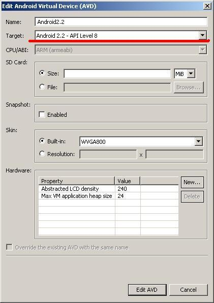
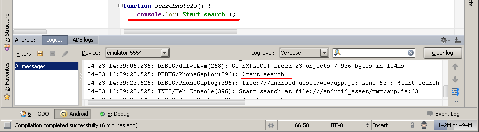

# PhoneGap Quick start guide

[[TOC]]

## Goal of this document

These tutorial describes process of creating mobile application that will provide for us hotels requested from Expedia API. It’s intended to get you basic information about rapid development and the most important things.

## Glossary

* jQM — jQuery Mobile
* App — Mobile application
* PG — PhoneGap

Important note: PhoneGap become a Apache project and changed name to Cordova. We will use most famous name PhoneGap, but please don’t be surprised when stumble upon Cordova in this text.

## Technologies overview and tools

We will use PhoneGap, HTML5, CSS3,  JavaScript, jQuery, jQuery Mobile, QUnit, Android 2.2, Idea 11, Google Chrome (Chromium, CoolNovo), Ripple.

Below is short description of this technologies and tools.

### PhoneGap mobile platform

**PhoneGap** (hereafter PG) is an HTML5 based app platform that allows you create native applications with web technologies and get access to API and app stores. 

* PhoneGap leverages web technologies developers already know best... HTML and JavaScript  instead of lower-level languages such as Objective-C and Java. 
* It fully cross platform: Apple iOS, Google Android, HP webOS, Microsoft Windows Phone, Nokia Symbian OS and RIM BlackBerry. You can see [supported feature matrix](http://phonegap.com/about/features).
* Open source: Now it is an Apache project named Cordova.
* Supported by community and big vendors (it was purchased by Adobe).
* Mature (incepted 2005). It is most popular in this segment of software.
* Well documented.

### How it works

You write application like a HTML page with rich JavaScript, then PG wrap it as application and after installation this page will be displayed in embedded native browser. Also PG provides you access to native API directly from JavaScript. This is achieved by enabling a Foreign Function Interface (FFI) to an embedded WebView or Webkit on the device.

From standard PG package are available Contacts, File system, Compass, Notification and [many other](http://docs.phonegap.com/en/1.5.0/index.html).

### Plugins

If standard PG Native API is not enough for you (for example work with clipboard), please check for [plugins repository](https://github.com/phonegap/phonegap-plugins). And of course you can [develop plugin by yourself](http://wiki.phonegap.com/w/page/36752779/PhoneGap%20Plugins).

### HTML5 and CSS3


New 5th version of HTML standard make a revolution in Web and mobile world.  Many features of HTML5 have been built with the consideration of being able to run on low-powered devices such as smartphones and tablets. It introduces new markup elements that reflect typical usage on modern websites.

Some of them are semantic replacements for common uses of generic block (`<div>`) and inline (`<span>`) elements, for example `<nav>` (website navigation block), `<footer>` (usually referring to bottom of web page), or <audio> and `<video>` instead of `<object>`.

Combination HTML5 with CSS3 and JavaScript allows us to create a powerful rich applications. 

### jQuery

Unfortunately JavaScript is very simple language with poor API. Also there is always troubles with interoperability. To resolve most of this problem we will use [jQuery](http://jquery.com/) — most powerful and extensible JS framework that uses easy to use syntax with flavor of functional paradigm. It simplifies HTML document traversing, event handling, animating, and AJAX interactions for rapid web development.

Plugin repository for jQuery can satisfy almost all needs.

### jQuery Mobile

jQuery has been long a popular JavaScript library for creating rich interactive websites and web apps. However, since it was designed primarily for desktop browsers, it doesn't have many features specifically designed for building mobile web apps.

jQuery Mobile is a project that addresses this shortfall. It's a framework built on top of jQuery that provides a range of user interface elements and features for you to use in your mobile apps.

* jQuery Mobile makes it easy to develop user interfaces for mobile web apps.
* The interface configuration is markup-driven, which means you can pretty much create your entire basic app interface in HTML, without needing to write a single line of JavaScript. (Of course, you'll still need to write JavaScript if your app is to do anything useful!)
* It provides a series of new custom events to let you detect mobile and touch specific actions like tap, tap-and-hold, swipe, and orientation change (i.e. rotating the device).
* It uses progressive enhancement to ensure that your app interface works on practically any web-enabled device.
* It uses themes to make it easy to customize the look of your app.

Just look into  [jQuery Mobile site](http://www.google.com/url?q=http%3A%2F%2Fjquerymobile.com%2F&sa=D&sntz=1&usg=AFQjCNHRX8vAjNI9lRbVQgdktxDl30X7kw) and try visual builder tool to create interface for your app.

### QUnit

QUnit is unit testing framework for JavaScript based on top of jQuery. Is quite simple. Please go to [QUnit homepage](http://www.google.com/url?q=http%3A%2F%2Fdocs.jquery.com%2FQUnit&sa=D&sntz=1&usg=AFQjCNH-_dlAtPD81jaC0LsDZF5C-pZE6w) where you can quickly learn how to create unit tests using it.

## How to develop?

[Official PG tutorial](http://www.google.com/url?q=http%3A%2F%2Fdocs.phonegap.com%2Fen%2F1.5.0%2Fguide_getting-started_index.md.html%23Getting%2520Started%2520Guides&sa=D&sntz=1&usg=AFQjCNFN4lC9YES9D7lv2H2Fugyxn8hhYQ) provide an information about developing for different platforms. It is not required any special SDK for PG - he is just a usual library attached to project (*.jar or *.dmg file).

Let’s start developing of Android application.

### Developing under windows for Android

We will use Java JDK 6 and Android SDK 2.2. Also we will use Idea 11 as development environment.

1. Download and Install JDK 6

2. Download and install Android SDK [http://developer.android.com/sdk/index.html](http://developer.android.com/sdk/index.html)

3. Open Android SDK manager and install Android 2.2 (API 8) package.

4. Run the Idea

Create new project from scratch with Android module.

You will get this page:


Setup Android SDK. JDK 6 is required for it:


You can use real device or emulator. Setup device emulator looks like on this picture:


Select Android 2.2 API 8



Your Hello World application is ready. Run it as Android app.


Idea created standard project structure. Please refer to [Android structure explanation](http://www.google.com/url?q=http%3A%2F%2Fsudarmuthu.com%2Fblog%2Fthe-structure-of-an-android-project&sa=D&sntz=1&usg=AFQjCNFLTIVGlEfczRflL_bopjZqLWFirw) for more details.

### Adding PG to application

In the root directory of the project, create two new directories:
* `/libs/`
* `/assets/www/`

Copy `cordova.js` from your PhoneGap download earlier to `/assets/www/`
Copy `cordova.jar` from your PhoneGap download earlier to `/libs/`
Please ensure that this jar is added to build path.
Copy `/xml/` folder from your PhoneGap download earlier to `/res/`

Now, we need to make several changes in your activity:
* Add `import org.apache.cordova.*;`
* Change the class's extend from Activity to DroidGap
* Replace the `setContentView()` line with `super.loadUrl("file:///android_asset/www/index.html");`

Also you need to set required permissions for your app. Please refer to `AndroidManifest.xml` and put something like this:
```xml
<supports-screens
        android:anyDensity="true"
        android:largeScreens="true"
        android:normalScreens="true"
        android:resizeable="true"
        android:smallScreens="true" />
<uses-permission android:name="android.permission.CAMERA" />
<uses-permission android:name="android.permission.VIBRATE" />
<uses-permission android:name="android.permission.ACCESS_COARSE_LOCATION" />
<uses-permission android:name="android.permission.ACCESS_FINE_LOCATION" />
<uses-permission android:name="android.permission.ACCESS_LOCATION_EXTRA_COMMANDS" />
<uses-permission android:name="android.permission.READ_PHONE_STATE" />
<uses-permission android:name="android.permission.INTERNET" />
<uses-permission android:name="android.permission.RECEIVE_SMS" />
<uses-permission android:name="android.permission.RECORD_AUDIO" />
<uses-permission android:name="android.permission.MODIFY_AUDIO_SETTINGS" />
<uses-permission android:name="android.permission.READ_CONTACTS" />
<uses-permission android:name="android.permission.WRITE_CONTACTS" />
<uses-permission android:name="android.permission.WRITE_EXTERNAL_STORAGE" />
<uses-permission android:name="android.permission.ACCESS_NETWORK_STATE" />
<uses-permission android:name="android.permission.GET_ACCOUNTS" />
<uses-permission android:name="android.permission.BROADCAST_STICKY" />
```

Add `android:configChanges="orientation|keyboardHidden"` to the activity tag in AndroidManifest. 

Add a second activity under you appliction tag in AndroidManifest.
```xml
<activity android:name="com.phonegap.DroidGap" android:label="@string/app_name" android:configChanges="orientation|keyboardHidden">
    <intent-filter></intent-filter>
</activity>
```

Example of resulting manifest:
```xml
<?xml version="1.0" encoding="utf-8"?>
<manifest xmlns:android="http://schemas.android.com/apk/res/android"
          package="com.hotwire.phonegap.helloworld"
          android:versionCode="1"
          android:versionName="1.0">
    <uses-sdk android:minSdkVersion="8"/>

    <supports-screens
            android:anyDensity="true"
            android:largeScreens="true"
            android:normalScreens="true"
            android:resizeable="true"
            android:smallScreens="true"/>
    <uses-permission android:name="android.permission.CAMERA"/>
    <uses-permission android:name="android.permission.VIBRATE"/>
    <uses-permission android:name="android.permission.ACCESS_COARSE_LOCATION"/>
    <uses-permission android:name="android.permission.ACCESS_FINE_LOCATION"/>
    <uses-permission android:name="android.permission.ACCESS_LOCATION_EXTRA_COMMANDS"/>
    <uses-permission android:name="android.permission.READ_PHONE_STATE"/>
    <uses-permission android:name="android.permission.INTERNET"/>
    <uses-permission android:name="android.permission.RECEIVE_SMS"/>
    <uses-permission android:name="android.permission.RECORD_AUDIO"/>
    <uses-permission android:name="android.permission.MODIFY_AUDIO_SETTINGS"/>
    <uses-permission android:name="android.permission.READ_CONTACTS"/>
    <uses-permission android:name="android.permission.WRITE_CONTACTS"/>
    <uses-permission android:name="android.permission.WRITE_EXTERNAL_STORAGE"/>
    <uses-permission android:name="android.permission.ACCESS_NETWORK_STATE"/>
    <uses-permission android:name="android.permission.GET_ACCOUNTS"/>
    <uses-permission android:name="android.permission.BROADCAST_STICKY"/>

    <application
            android:icon="@drawable/ic_launcher"
            android:label="@string/app_name">
        <activity
                android:name=".HelloPhoneGapActivity"
                android:label="@string/app_name"
                android:configChanges="orientation|keyboardHidden">
            <intent-filter>
                <action android:name="android.intent.action.MAIN"/>
                <category android:name="android.intent.category.LAUNCHER"/>
            </intent-filter>
        </activity>
        <activity
                android:name="com.phonegap.DroidGap"
                android:configChanges="orientation|keyboardHidden"
                android:label="@string/app_name">
            <intent-filter>
            </intent-filter>
        </activity>
    </application>
</manifest>
```

Now create and open a new file named index.html in the `/assets/www/` directory. Paste the following code:
```html
<!DOCTYPE HTML>
<html>
<head>
	<title>PhoneGap</title>
</head>
<body>
<h1>Hello World</h1>
</body>
</html>
```

Run this application and enjoy.

## jQuery and jQuery Mobile

We will use jQuery for DOM manipulations and AJAX calls. All UI we will build with HTML and jQuery Mobile (jQM).

Create `index.html` and paste this content:

### Anatomy of this page

As you see, we use new HTML5 [custom attributes](http://dev.w3.org/html5/spec/global-attributes.html#embedding-custom-non-visible-data-with-the-data-attributes) with prefix `data-*`.

jQM uses a lot of this attributes. All of them are listed in [separate reference](http://jquerymobile.com/test/docs/api/data-attributes.html).

#### Pages

The one important thing is a jQM support of multi-paging. 

A single HTML document can contain multiple 'pages' that are loaded together by stacking multiple divs with a data-role of "page". Each 'page' block needs a unique ID (`id="foo"`) that will be used to link internally between 'pages' (`href="#foo"`). When a link is clicked, the framework will look for an internal 'page' with the ID and transition it into view.

Also you can change pages programmatically:
```js
$.mobile.changePage('#dashboard');
```

Important: Use `$(document).bind('pageinit')`, not `$(document).ready()`

The first thing you learn in jQuery is to call code inside the `$(document).ready()` function so everything will execute as soon as the DOM is loaded. However, in jQuery Mobile, Ajax is used to load the contents of each page into the DOM as you navigate, and the DOM ready handler only executes for the first page. To execute code whenever a new page is loaded and created, you can bind to the pageinit event. This event is explained in detail at the bottom of this page.

### Place all application logic in `application.js`


### Cross domain AJAX problem solving

The initial application document is loaded by the PhoneGap application by a local `file://` URL. This means that if you want to pull in pages from your company's remote server (phone home) you will have to refer to them with absolute URLs to your server. Because your document originates from a `file://` URL, loading pages or assets from your remote server is considered a cross-domain request that can be blocked in certain scenarios.

Your ability to access cross-domain pages from within a PG jQuery Mobile application is controlled by two key things: `$.support.cors` and `$.mobile.allowCrossDomainPages`, and can also be influenced by the white list feature in later builds of PhoneGap. More detailed information see [here](http://jquerymobile.com/test/docs/pages/phonegap.html).

### Using native API

All device features are Native API: Contacts, Compass, etc. For using native API you need to include `cordova.js` file in your html. This file contains javascript wrappers for native functions.

Also you can find comprehensive example of using API in distribution archive (`/lib/android/example/` folder inside `phonegap.zip`).

## Debugging 

Easy debugging is a very important for rapid development.

### Debugging in emulator

You can run your app in Android emulator and see log messages using adb tool. In these logs you can find browser errors and JavaScript `console.log()` messages.

When you run debug from Idea will show log in separate Logcat tool window:



But that’s all what you can. Debug of JavaScript is impossible.

### Debugging in desktop browser

Since the PG app is just a web page you can use usual browser to test your application. Also Idea has a nice [JavaScript debugger](http://wiki.jetbrains.net/intellij/Debugging_JavaScript_with_IntelliJ_IDEA) that really helps a lot.

But all native API calls will be failed in desktop browsers. To avoid this problem there is [Ripple](http://ripple.tinyhippos.com/) emulator that you can install as [Chrome extension](https://chrome.google.com/webstore/detail/geelfhphabnejjhdalkjhgipohgpdnoc).

Since we will debug local file, we need to give this application rights for the local file scheme (`file://`).

Open the Extensions tab, locate Ripple in the list, and check off the `Allow access to file URLs` checkbox.

Then go to the Idea and run your index.html with local JavaScript debugger.

Ripple will determine that your page uses PG and wrap it in emulator:


Now you can debug using of native API as usual script.


## Building app for all platforms using PG build system

If you tried to build your application for all platforms you can use [PG build service.](https://build.phonegap.com/) Just upload it to the PG Build service and get back app-store ready apps for Apple iOS, Google Android, Palm, Symbian, Blackberry and more.

### How to use build service

There is [excellent guide ](https://build.phonegap.com/docs/start)how to use PG build service.

First of all you need to create [Widget Packaging and XML Configuration ](http://www.w3.org/TR/widgets/)manifest in `/assets/www/` folder of your project named config.xml. 

```xml
<?xml version="1.0" encoding="UTF-8"?>
<widget xmlns		= "http://www.w3.org/ns/widgets"
	xmlns:gap	= "http://phonegap.com/ns/1.0"
	id		= "com.phonegap.getting.started"
	version 	= "1.0.0">
	<name>PhoneGap: Getting Started</name>
	<description>Example of application</description>
	<icon src="icon.png" gap:role="default" />
	<feature name="http://api.phonegap.com/1.0/geolocation"/>
	<feature name="http://api.phonegap.com/1.0/network"/>
	<preference name="orientation" value="portrait" />
</widget>
```

Also maybe you wish to place here icon file for application.

Then upload `/assets/www/` folder to PG build service and he will start a build immediately. 


## Authors
* Sergey Ponomarev
* Dmitry Stonaev

v. 1.0.1 23 April 2012
